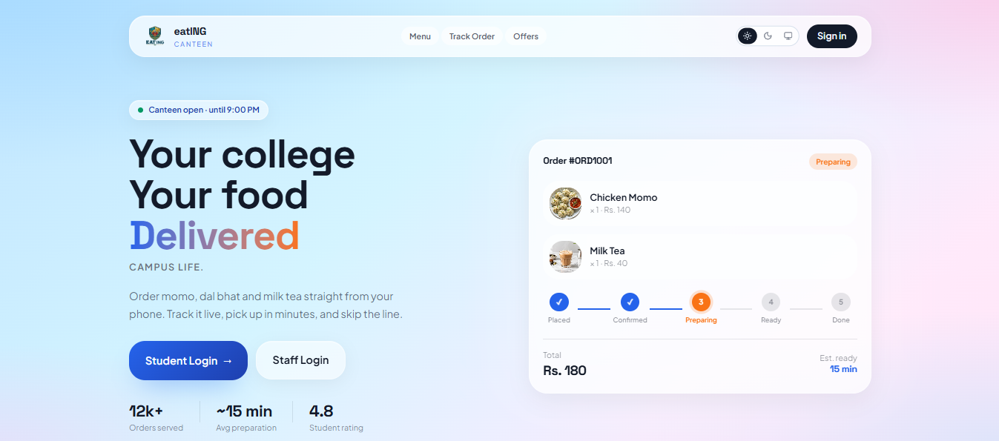
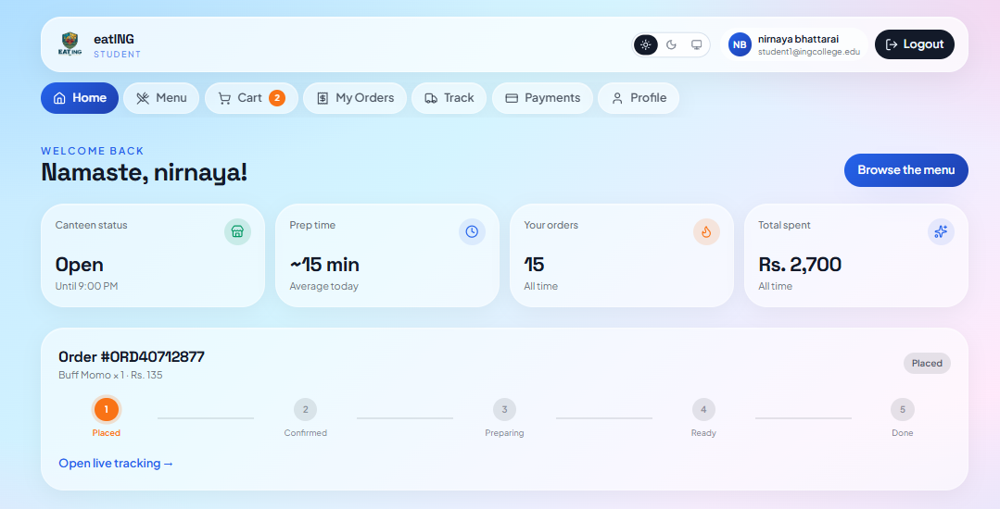
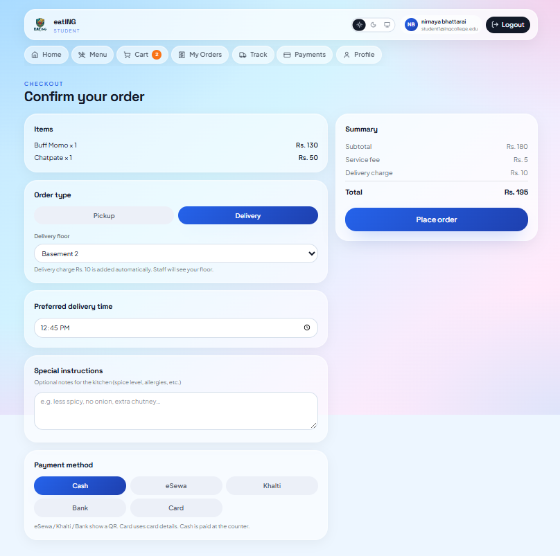
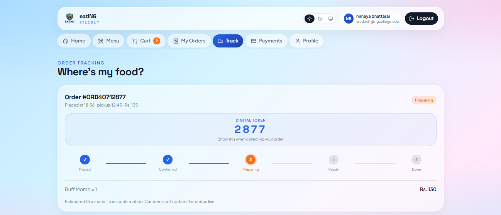
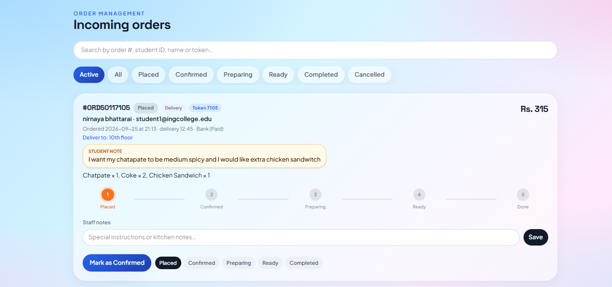
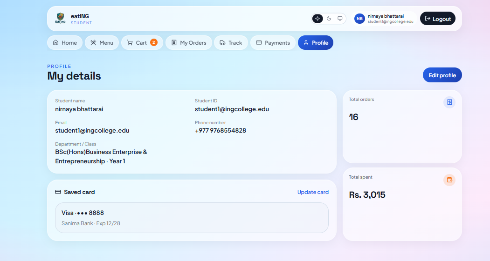
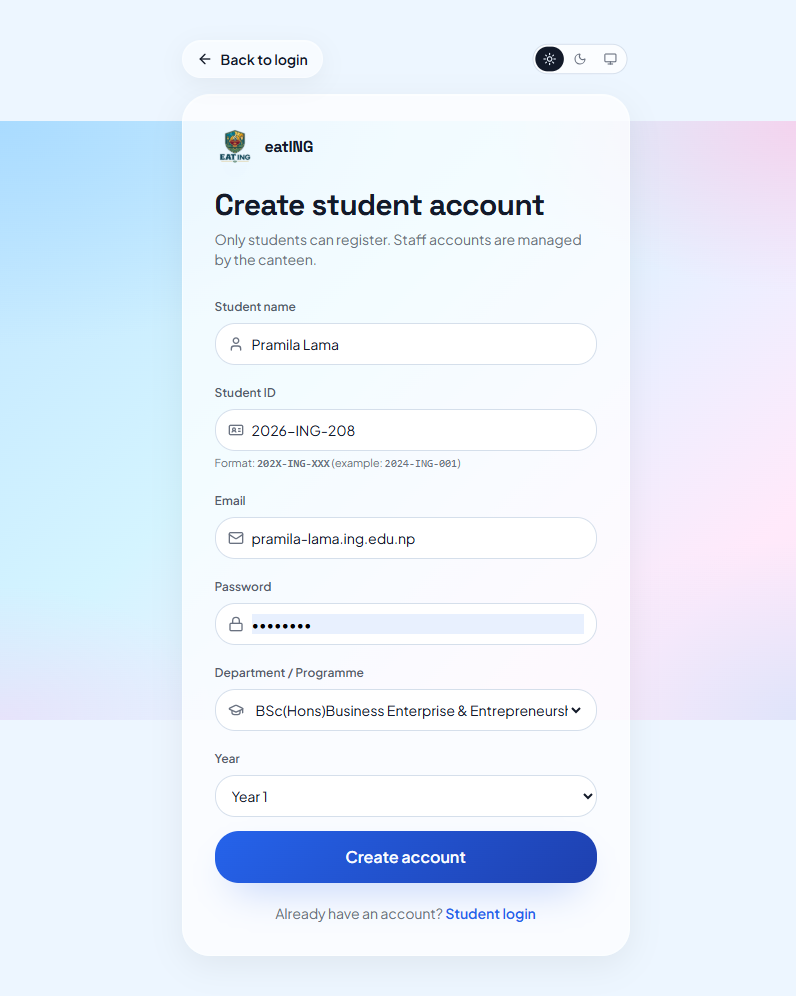

# eatING — Campus Canteen Ordering

**eatING** is a full-stack web app for ordering food from the college canteen — built for **Innovation Week** at **ING College of Innovation and Leadership**.

Students can browse the menu, place pickup or delivery orders, pay (cash / digital), and track order status live. Staff can manage the kitchen queue, update statuses, edit the menu, and leave notes.

> Built with modern web tools and assistance from AI for scaffolding, debugging, and UI polish — designed, tested, and customized for a real campus workflow.

---

## Event

| | |
|---|---|
| **Event** | Innovation Week |
| **Institution** | ING College of Innovation and Leadership |
| **Project** | Digital canteen ordering & kitchen operations |

---

## Features

### Student
- Browse menu by category (Snacks, Meals, Drinks)
- Cart with quantities and live totals
- Checkout: **Pickup** or **Delivery** (with location + delivery fee)
- Payment options: Cash, eSewa, Khalti, Card
- Optional **kitchen notes** (allergies, spice, etc.)
- Live order tracking (Placed → Confirmed → Preparing → Ready → Completed)
- Order history, cancel (when allowed), feedback

### Staff
- Live order queue with filters and search
- Advance order status through the kitchen flow
- Solid **student note** display with “View all” for long notes
- Staff notes per order
- Menu management (availability / stock)
- Student list & sales overview (where enabled)

### Platform
- Auth for student and staff portals
- Supabase backend (database + realtime updates)
- Responsive UI with light/dark theme support

---

## Screenshots

### Landing


### Student menu


### Checkout


### Order tracking


### Staff orders


### User profile


### Create account
)


## Tech stack

- **Frontend:** React, TypeScript, TanStack Router / Start, Vite, Tailwind CSS
- **Backend:** Supabase (Auth, Postgres, Row Level Security, Realtime)
- **UI:** Radix-based components, custom campus theme

---

## Getting started

### Prerequisites
- Node.js 18+
- A Supabase project

### Setup

```bash
git clone https://github.com/cozy-void/eatING.git
cd eatING
npm install
cp .env.example .env
